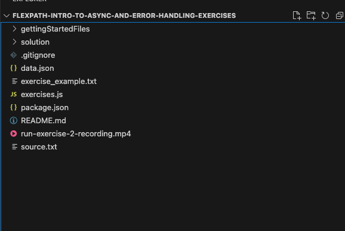
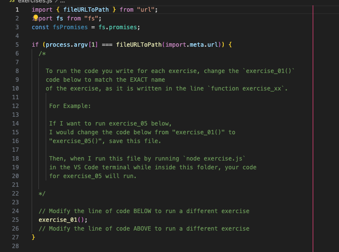

# flexpath-intro-to-async-and-error-handling-exercises

## Exercise overview

The intention of this exercise is to give you more experience working with
collections and loops in JavaScript.

## Getting Started

1. Using Visual Studio Code, open the folder `flexpath-intro-to-async-and-error-handling-exercises` 
   wherever you saved it on your device. 
2. Your VS code file explorer window should look like this:
   
3. Then open up the `exercises.js` file in the `flexpath-intro-to-async-and-error-handling-exercises` folder. 
   Inside of this file we have provided exercises for you to complete, written 
   in code comments. For each exercise, please code ONLY in the space 
   between the comments `// CODE IN THE OPEN LINES BELOW` and `// CODE IN THE OPEN LINES ABOVE` 
4. To run your code for different exercises, you will update the exercise mentioned
   on line 20 of the file. 
   
5. After changing that line, make sure to SAVE the file before running it.
6. To run your code in exercises.js, you will update line 25 to run the exercise code
   you want to run and save the file. THEN, open a Terminal window in VS Code 
   by going to your toolbar at the top of the page and selecting 
   "Terminal" -> "New Terminal"
7. Inside of this terminal, check that you have Node.js installed by running the 
   command `node -v`. If your computer doesn't recognize that keyword, please
   go back and ensure you installed Node.js correctly.
8. To run `exercises.js` you will then use the command `node exercises.js` in the
   terminal to run the file.

We have included the screen recording from exercise 2 showing how to run these
types of exercise files. 

Exercise solutions are in the `/solution` folder

&nbsp;
---

### Summary of JavaScript Concepts Covered in These Exercises

1. **Asynchronous Programming**:
    
    - Explanation of synchronous vs. asynchronous operations.
    - Use cases for asynchronous logic, such as API calls and file operations.
    - Working with callbacks, promises, and async/await.
    - Understanding callback hell and the pyramid of doom.
2. **Callbacks**:
    
    - Writing functions that are executed after an asynchronous task completes.
    - Handling errors in callbacks and passing results as parameters.
3. **Promises**:
    
    - Creating and using promises to manage asynchronous operations.
    - Chaining promises to handle sequential asynchronous tasks.
    - Using `.then()`, `.catch()`, and `.finally()` for promise handling.
    - Error handling in promise chains.
4. **Async/Await**:
    
    - Simplifying asynchronous code using async/await syntax.
    - Using try-catch blocks for error handling in async/await.
    - Understanding top-level await in modern JavaScript.
5. **Error Handling**:
    
    - Using `try-catch` for both synchronous and asynchronous code.
    - Throwing custom errors and handling them in a structured way.
6. **Node.js File System API**:
    
    - Using the callback and promise-based versions of the Node.js File System API.
    - Reading and writing files asynchronously with proper error handling.
7. **Event Handling**:
    
    - Using the EventEmitter in Node.js to listen for and emit events.
    - Examples of handling system events, mouse clicks, and keypresses.
8. **Global Promise Methods**:
    
    - Using `Promise.all`, `Promise.allSettled`, `Promise.any`, and `Promise.race` for managing multiple promises concurrently.
